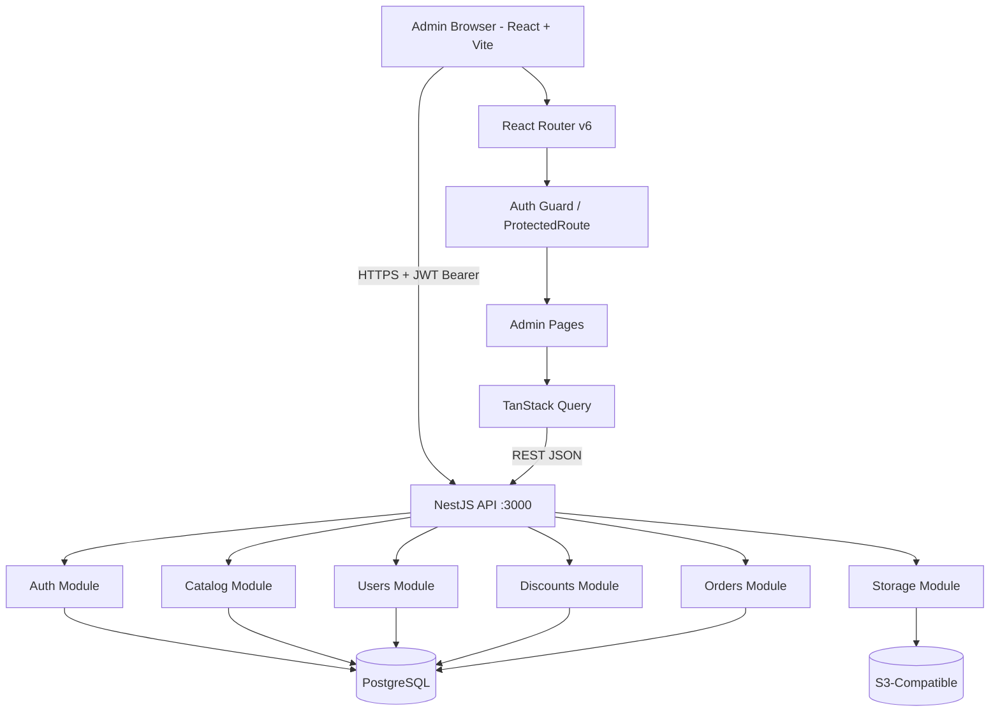

# System Design & Architecture — Admin Dashboard

## Architecture Overview
**What is the high-level system structure?**



### Key Components & Responsibilities
| Component | Responsibility |
|-----------|---------------|
| `AuthContext` | Stores JWT, user info, expiry; provides `login`, `logout`, `isAuthenticated` |
| `ProtectedRoute` | Redirects unauthenticated users to `/login`; checks `ADMIN` role |
| `ApiClient` (Custom fetch client) | Base URL + JWT header injection via interceptor; 401 handler to logout |
| `Layout` | Sidebar + topbar shell wrapping all admin pages |
| `DataTable` | Reusable shadcn/ui `Table` + pagination + search wrapper |
| Feature Pages | Products, Users, Coupons, Orders, Categories, Tags — each owns forms & query hooks |

### Technology Stack Choices & Rationale
| Technology | Choice | Rationale |
|------------|--------|-----------|
| Bundler/Framework | Vite + React | Fast HMR, lightweight — no need for SSR in admin |
| Language | TypeScript | Consistency with rest of monorepo |
| Styling | Tailwind CSS v3 | Already used in storefront; utility-first, rapid UI |
| Component Library | shadcn/ui | Headless Radix primitives + Tailwind; copy-paste components into repo |
| Routing | React Router v6 | Standard SPA routing; nested layouts |
| Data Fetching | TanStack Query v5 | Cache, background refetch, optimistic updates; server state management |
| Forms | React Hook Form + Zod | Performant, schema-driven validation |
| HTTP Client | Custom fetch client | Interceptors for auth header injection + 401 handling |
| Icons | lucide-react | Ships with shadcn/ui; consistent icon set |
| Charts | Recharts | Lightweight, composable; used for dashboard KPI charts |

## Data Models
**What data do we need to manage?**

> All entities come from the existing backend API. Admin app holds no local database. Types are derived from API responses.

### Core Types (TypeScript interfaces in `src/types/`)

```ts
// User
interface User {
  id: string; email: string; name: string; role: 'ADMIN' | 'CUSTOMER';
  isActive: boolean; createdAt: string;
}

// Product
interface Product {
  id: string; name: string; slug: string; description: string;
  isPublished: boolean; categoryId: string | null; tags: Tag[];
  variants: ProductVariant[]; createdAt: string;
}

interface ProductVariant {
  id: string; sku: string; options: Record<string, string>;
  stock: number; reservedStock: number; prices: ProductVariantPrice[];
}

interface ProductVariantPrice { currency: string; amount: number; }

// Category
interface Category {
  id: string; name: string; slug: string; parentId: string | null;
  children?: Category[];
}

// Tag
interface Tag { id: string; name: string; }

// Coupon / Discount
interface Coupon {
  id: string; code: string; type: 'PERCENTAGE' | 'FIXED';
  amount: number; currency?: string; expiresAt: string | null;
  usageLimit: number | null; usageCount: number; isActive: boolean;
}

// Order
interface Order {
  id: string; status: 'PENDING' | 'PAID' | 'FULFILLED' | 'CANCELLED';
  userId: string; currency: string; totalAmount: number;
  items: OrderItem[]; createdAt: string;
}

interface OrderItem {
  id: string; variantId: string; quantity: number;
  unitPrice: number; currency: string;
}

// Paginated response wrapper
interface PaginatedResponse<T> {
  data: T[]; total: number; page: number; limit: number;
}
```

## API Design
**How do components communicate?**

### API Base URL
```
http://localhost:3000/api/v1
```

### Endpoint Map (consumed by admin)

| Module | Method | Endpoint | Description |
|--------|--------|----------|-------------|
| Auth | POST | `/auth/login` | Get JWT |
| Auth | GET | `/auth/me` | Current user profile |
| Users | GET | `/users?page&limit&search` | List users |
| Users | PATCH | `/users/:id` | Update role / active status |
| Products | GET | `/catalog/products?page&limit&search&published` | List products |
| Products | POST | `/catalog/products` | Create product |
| Products | PATCH | `/catalog/products/:id` | Update product |
| Products | DELETE | `/catalog/products/:id` | Delete product |
| Variants | POST | `/catalog/products/:id/variants` | Add variant |
| Variants | PATCH | `/catalog/variants/:id` | Update variant |
| Variants | DELETE | `/catalog/variants/:id` | Delete variant |
| Categories | GET/POST/PATCH/DELETE | `/catalog/categories` | Full CRUD |
| Tags | GET/POST/DELETE | `/catalog/tags` | Full CRUD |
| Coupons | GET/POST/PATCH/DELETE | `/discounts/coupons` | Full CRUD |
| Orders | GET | `/orders?page&limit&status` | List orders |
| Orders | GET | `/orders/:id` | Order detail |
| Orders | PATCH | `/orders/:id/status` | Transition status |
| Storage | POST | `/storage/upload` | Upload product image (multipart) |

### Authentication / Authorization
- All requests except `POST /auth/login` require `Authorization: Bearer <token>` header.
- `ProtectedRoute` component reads token from `AuthContext`; redirects to `/login` if missing/expired.
- Backend guards reject non-ADMIN users with `403`; admin app will show error toast.

## Component Breakdown
**What are the major building blocks?**

```
apps/admin/src/
├── api/                    # Custom fetch client + typed API functions per domain
│   ├── client.ts           # Custom fetch client with interceptors
│   ├── auth.api.ts
│   ├── products.api.ts
│   ├── users.api.ts
│   ├── coupons.api.ts
│   ├── orders.api.ts
│   └── categories.api.ts
├── components/
│   ├── layout/
│   │   ├── AppLayout.tsx   # Sidebar + Topbar shell
│   │   ├── Sidebar.tsx
│   │   └── Topbar.tsx
│   ├── ui/                 # shadcn/ui generated components
│   └── shared/
│       ├── DataTable.tsx   # Generic table with pagination
│       ├── ConfirmDialog.tsx
│       ├── ImageUpload.tsx
│       └── StatusBadge.tsx
├── contexts/
│   └── AuthContext.tsx
├── hooks/
│   ├── useProducts.ts      # TanStack Query hooks per domain
│   ├── useUsers.ts
│   ├── useCoupons.ts
│   └── useOrders.ts
├── pages/
│   ├── LoginPage.tsx
│   ├── DashboardPage.tsx
│   ├── products/
│   │   ├── ProductsPage.tsx
│   │   ├── ProductFormPage.tsx
│   │   └── ProductVariantsSection.tsx
│   ├── users/
│   │   └── UsersPage.tsx
│   ├── coupons/
│   │   ├── CouponsPage.tsx
│   │   └── CouponFormPage.tsx
│   ├── orders/
│   │   ├── OrdersPage.tsx
│   │   └── OrderDetailPage.tsx
│   └── categories/
│       └── CategoriesPage.tsx
├── types/
│   └── index.ts            # All API entity interfaces
├── lib/
│   └── utils.ts            # shadcn/ui cn() utility
├── App.tsx                 # Router + QueryClientProvider + AuthProvider
└── main.tsx
```

## Design Decisions
**Why did we choose this approach?**

| Decision | Rationale |
|----------|-----------|
| **Vite over Next.js** | Admin is a pure SPA — no SEO needed, no SSR. Vite is faster to scaffold and simpler to configure. |
| **shadcn/ui** | Gives professional, accessible components without heavy runtime cost; components are owned in-repo and customizable. |
| **TanStack Query** | Eliminates hand-written loading/error state; invalidation-based cache updates after mutations make optimistic UI trivial. |
| **React Hook Form + Zod** | Best-in-class DX for complex forms (product variants with nested arrays); Zod schemas double as TypeScript types. |
| **Separate `apps/admin`** | Keeps admin bundle separate from storefront; independent deploy; protects admin URLs from public discovery. |

### Alternatives Considered
- **Next.js for admin**: Overkill, adds server complexity where not needed.
- **Using same Vite app as storefront with route guards**: Merges customer and admin code, increasing bundle size and surface area.

## Non-Functional Requirements
**How should the system perform?**

- **Build size**: Admin bundle should be < 2 MB gzipped (shadcn/ui tree-shaking).
- **Auth security**: Token stored in `localStorage` with expiry check on every route render; no token = redirect to login.
- **Form validation**: All forms show field-level errors before submission; Zod schemas enforced client-side.
- **Accessibility**: shadcn/ui Radix primitives are keyboard navigable; modals trap focus by default.
- **Dev experience**: `pnpm --dir apps/admin dev` starts on port `5174`; hot module replacement works with Vite.
