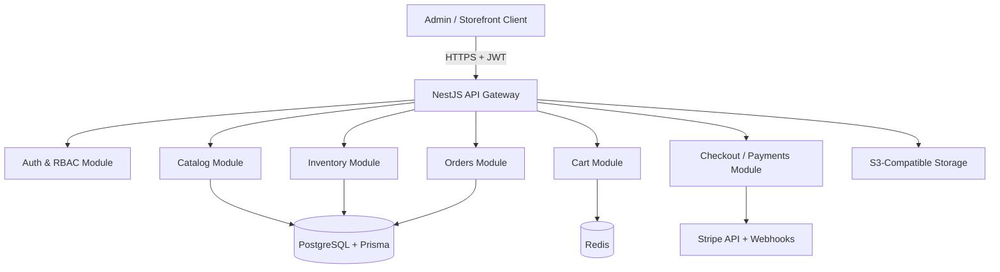

# System Design & Architecture

## Architecture Overview
**What is the high-level system structure?**

### Key components and responsibilities
- **Auth & RBAC**: JWT login, email/password plus Google OAuth, role decorators, and guard enforcement
- **Catalog**: products, categories, tags, variants, per-currency price books, and media references
- **Inventory**: on-hand stock, reserved stock, safety checks, and transactional release/confirm flows
- **Cart**: Redis-backed persistent cart keyed by authenticated user/session
- **Checkout / Payments**: pricing snapshot, coupon validation, hosted Stripe Checkout Session creation, and webhook processing
- **Orders**: order persistence, status transitions, customer history, and admin fulfillment views
- **Shared platform**: validation, global exception filters, structured logging via Pino, and Swagger docs

### Technology stack choices and rationale
- **NestJS** for modular organization, guards, interceptors, DI, and long-term maintainability
- **Prisma + PostgreSQL** for relational integrity across orders, products, coupons, inventory entities, and per-currency price records
- **Redis** for low-latency cart persistence and short-lived checkout/cart state
- **Stripe Checkout Sessions** for the fastest secure hosted checkout path with webhook-based final status confirmation
- **Pino** for high-performance structured application logging in NestJS
- **LocalStack** to emulate S3-compatible storage dependencies in local development

## Data Models
**What data do we need to manage?**

### Core entities and relationships
- `User` with `role` (`ADMIN` or `CUSTOMER`) and support for email/password plus Google OAuth identity linkage
- `Category` with optional self-referencing parent/child tree
- `Tag` connected to `Product` through many-to-many relation
- `Product` containing metadata, publish status, and one-to-many `ProductVariant`
- `ProductVariant` with a unique SKU, option snapshot, stock counts, and one-to-many `ProductVariantPrice` rows
- `ProductVariantPrice` storing explicit amount + currency pairs for multi-currency pricing
- `Coupon` with percentage/fixed discounts, expiration, and usage limit metadata
- `Order` and `OrderItem` capturing pricing snapshots, selected currency, and purchased variant details
- `InventoryReservation` to track temporary stock holds during checkout
- `WebhookEvent` for Stripe idempotency and auditability

### Data flow between components
1. Admin creates or updates a `Product`, related `ProductVariant` rows, and explicit per-currency prices.
2. Authenticated customer adds a variant to cart; Redis stores quantity and currency-aware price snapshot candidate.
3. Checkout validates coupon, tax/shipping rules, calculates totals, and requests an inventory reservation inside a PostgreSQL transaction.
4. A hosted Stripe Checkout Session is created; the order remains `PENDING` until asynchronous confirmation.
5. The webhook confirms payment outcome and transitions the order to `PAID` or `CANCELLED`, consuming or releasing stock immediately as required.

## API Design
**How do components communicate?**

### External APIs
- REST JSON endpoints under `/api/v1`
- Swagger/OpenAPI served for local and non-production environments
- Stripe webhook endpoint under `/api/v1/webhooks/stripe`

### Internal interfaces
- `InventoryService.reserveStock()` / `releaseReservation()` / `confirmReservation()` backed by PostgreSQL transactions and row-level locking
- `CheckoutService.createCheckout()` coordinating pricing, coupon validation, tax/shipping calculation, and hosted Stripe Checkout Session creation
- `OrdersService.markPaid()` / `markCancelled()` for webhook-driven state changes
- `CatalogPricingService.resolvePrice(variantId, currency)` for multi-currency price lookup

### Authentication/authorization approach
- **Customer flows** use JWT bearer tokens with `CUSTOMER` scope
- **Admin routes** require `ADMIN` via `@Roles('ADMIN')` decorator plus a roles guard
- **Webhook route** is public but authenticated via Stripe signature verification and idempotency checks

## Component Breakdown
**What are the major building blocks?**

### Backend services/modules
- `auth`
- `users`
- `catalog`
- `inventory`
- `cart`
- `discounts`
- `checkout`
- `payments`
- `orders`
- `storage`
- `common` (filters, decorators, guards, logging)

### Database/storage layer
- PostgreSQL persists long-lived business entities
- Redis stores carts and short-lived reservation/session data
- S3-compatible storage stores product images and generated artifacts

## Design Decisions
**Why did we choose this approach?**

- **Modular monolith first** keeps deployment simple while enforcing internal domain separation
- **Reservation-based inventory with PostgreSQL row-level locking** reduces oversell risk compared to naive decrement-on-payment-complete flows or Redis-only locking
- **Webhook-driven payment finalization** ensures asynchronous payment outcomes remain source-of-truth
- **Hosted Stripe Checkout Sessions first** reduces PCI scope and speeds delivery versus a fully custom payment UI
- **Variant-first SKU modeling with per-currency price books** allows flexible merchandising across sizes/colors and regions without duplicating base product records

### Alternatives considered
- Microservices were rejected for the initial phase due to operational overhead
- Cart persistence in PostgreSQL was deprioritized in favor of Redis for speed and TTL-friendly behavior
- Polling Stripe for final states was rejected in favor of signed webhooks and idempotent event handling

## Non-Functional Requirements
**How should the system perform?**

- **Performance**: catalog reads should be cacheable; stock reservation should remain transactional and low latency under concurrency
- **Scalability**: stateless API instances scale horizontally; Redis and PostgreSQL remain shared state layers
- **Security**: DTO validation, JWT verification, Google OAuth support, secure secrets management, Stripe signature validation, and least-privilege RBAC
- **Reliability**: idempotent webhook handling, immediate retry-safe inventory release on failed/expired payments, structured Pino logs, health checks, and containerized local infra
