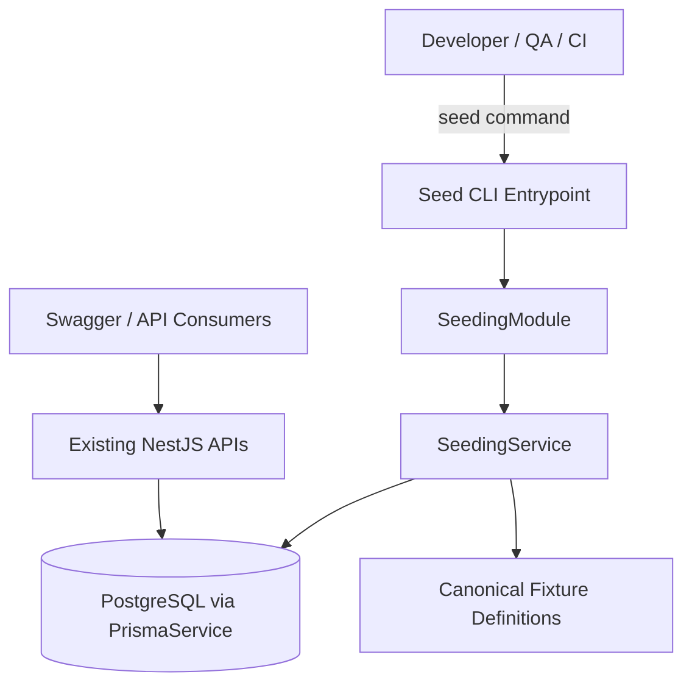

# System Design & Architecture

## Architecture Overview
**What is the high-level system structure?**

### Key components and responsibilities
- **Seed CLI entrypoint**: launches the seeding workflow from a script such as `pnpm seed`
- **`SeedingModule`**: wires Nest dependencies needed for fixture creation
- **`SeedingService`**: coordinates idempotent upserts for users, catalog data, and coupons
- **Fixture definitions**: keep sample records centralized and version-controlled
- **Prisma/PostgreSQL**: stores the actual seeded data used by the application

### Technology stack choices and rationale
- **NestJS module/service pattern** keeps seed logic consistent with the rest of the codebase
- **Prisma upserts and transactions** provide safe, repeatable database bootstrap behavior
- A **CLI-driven workflow** avoids exposing dangerous write operations over HTTP

## Data Models
**What data do we need to manage?**

### Core entities and relationships
The seeding module should populate existing schema entities rather than introduce new tables in v1:

- `User` + `AuthIdentity`
  - admin account for protected routes and Swagger testing
  - customer account for cart/checkout/order flows
- `Category` and `Tag`
  - canonical catalog metadata used by seeded products
- `Product`, `ProductVariant`, `ProductVariantPrice`
  - representative fixtures with known slugs/SKUs and multi-currency examples
- `Coupon`
  - reusable promo codes such as `AURA20` for checkout validation

### Seed metadata shape
A simple internal structure is sufficient:

- `SeedProfile`: `minimal | demo | test` (optional in v1, but design-ready)
- `SeedSummary`: counts of created/updated records per entity group
- Stable identifiers based on unique keys:
  - `email`
  - `slug`
  - `sku`
  - `code`

### Data flow between components
1. Operator runs the seed command.
2. The CLI bootstraps `SeedingModule` and resolves `SeedingService`.
3. The service validates environment safety (non-production or explicit override).
4. Fixture groups are upserted in dependency order:
   - users/auth identities
   - categories/tags
   - products/variants/prices
   - coupons
5. The command logs a summary and exits with success or failure.

## API Design
**How do components communicate?**

### External APIs
No public REST endpoint is required for v1.

Instead, the feature exposes a **developer/operator CLI workflow**, for example:

- `pnpm seed`
- `pnpm prisma:seed`
- `pnpm ts-node prisma/seed.ts --profile=demo`

### Internal interfaces
- `SeedingService.seed(profile?: string): Promise<SeedSummary>`
- `SeedingService.seedUsers()`
- `SeedingService.seedCatalog()`
- `SeedingService.seedCoupons()`

### Request/response format
- CLI input: optional profile or flags
- CLI output: structured log summary of created/updated counts and notable fixture identifiers

### Authentication/authorization approach
- No bearer-auth API surface is added
- Seeding is restricted by **environment guardrails** and operator intent, not by a public route
- The workflow should default to **disabled/safe** behavior in production contexts unless explicitly overridden

## Component Breakdown
**What are the major building blocks?**

### Backend services/modules
- `src/seeding/seeding.module.ts`
  - imports `PrismaModule` and registers the seeding service
- `src/seeding/seeding.service.ts`
  - performs the actual upsert orchestration
- `src/seeding/fixtures/*`
  - optional fixture-definition files for users, catalog, and coupons
- `prisma/seed.ts` or `src/seeding/run-seed.ts`
  - CLI bridge used by package scripts / Prisma seed integration

### Database/storage layer
- **PostgreSQL / Prisma** remains the only persistent target for seeded data in v1
- No additional external storage dependency is required for the initial seeding module
- Product media can use placeholder URLs until richer seeded assets are needed

## Design Decisions
**Why did we choose this approach?**

- **CLI over HTTP endpoint**: safer and easier to restrict
- **Idempotent upsert model**: lets developers re-run seeding after schema resets or fixture changes
- **Centralized fixture definitions**: avoids hard-coded demo values being scattered across multiple services
- **Reuse existing example identities and catalog values**: keeps local docs, Swagger flows, and tests aligned

### Alternatives considered
- **Raw SQL seed scripts only** were rejected because they are harder to keep aligned with Nest/Prisma domain logic
- **One-off in-memory seed helpers** were rejected because they do not populate the real database consistently
- **Full production import pipeline** was deferred because v1 only needs repeatable sample data

## Non-Functional Requirements
**How should the system perform?**

- **Performance**: minimal/demo seeding should finish quickly on a local machine and avoid unnecessary repeated writes
- **Scalability**: fixture groups should be extensible as new modules are added
- **Security**: do not expose seeding publicly; keep demo passwords local-only and clearly documented
- **Reliability**: the command should be safe to run multiple times and should fail with actionable logs if a dependency order issue occurs
