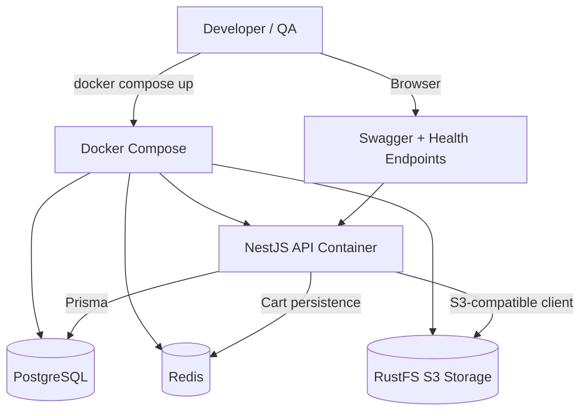

# System Design & Architecture

## Architecture Overview
**What is the high-level system structure?**

### Key components and responsibilities
- **API container**: runs the NestJS app, exposes port `3000`, and connects to service hostnames inside the Docker network
- **PostgreSQL container**: persists relational application data for Prisma-backed modules
- **Redis container**: supports cart/session-style caching and the existing Redis-backed cart behavior
- **RustFS container**: provides the S3-compatible object storage target used by the media-storage feature
- **Named volumes**: persist database, cache, and object-store state across container restarts

### Technology stack choices and rationale
- **Docker Compose** is the simplest way to orchestrate all local dependencies with a single command
- **RustFS** replaces the remaining LocalStack-oriented local object-store setup and aligns with the approved media-storage design
- **Named volumes + health checks** improve startup reliability without introducing production-only complexity
- **Environment-variable wiring** keeps the app portable between local host execution and containerized execution

## Data Models
**What data do we need to manage?**

This feature does not introduce new business-domain entities. It mainly standardizes the local runtime configuration surfaces:

- `DATABASE_URL` → points the API container to `postgres:5432`
- `REDIS_URL` → points the API container to `redis:6379`
- `S3_ENDPOINT` / `S3_PUBLIC_BASE_URL` / `S3_BUCKET` / credentials → point the API container to RustFS
- Docker volumes preserve:
  - PostgreSQL data
  - Redis data
  - RustFS object-store data/logs

### Data flow between components
1. `docker compose up --build` starts the service graph.
2. The API waits for PostgreSQL and Redis readiness conditions.
3. The NestJS app reads container-specific env values and starts on port `3000`.
4. Prisma-backed modules use PostgreSQL, cart persistence uses Redis, and media upload flows use RustFS.
5. Developers interact through Swagger, health endpoints, and normal API routes.

## API Design
**How do components communicate?**

### External APIs
No new business API routes are required. The feature operationalizes existing endpoints:

- `GET /api/v1/health/live`
- `GET /api/v1/health/ready`
- `GET /api/docs`
- Existing auth/catalog/cart/checkout endpoints already in the service

### Internal interfaces
- `docker-compose.yml` defines runtime dependencies and networking
- `Dockerfile` builds the NestJS runtime image
- Existing `PrismaService`, `CartService`, and `StorageService` consume env-based connection settings

### Authentication/authorization approach
- No auth model changes are required
- Existing JWT + RBAC flows remain unchanged
- Only infrastructure access paths are added/exposed for local development (API port, DB/Redis ports, RustFS API + console)

## Component Breakdown
**What are the major building blocks?**

### Backend/services
- `docker-compose.yml`
  - define `api`, `postgres`, `redis`, and `rustfs` services
- `Dockerfile`
  - build/install dependencies for the NestJS app image
- `.dockerignore`
  - reduce build context noise and prevent copying large/local artifacts
- `README.md`
  - explain the intended local commands and ports

### Database/storage layer
- **PostgreSQL** remains the single source of truth for app data
- **Redis** continues to support cart persistence/fallback behavior
- **RustFS** provides the expected S3-compatible object store for product media

## Design Decisions
**Why did we choose this approach?**

- **Containerize the API as well as dependencies** so onboarding is fully self-contained
- **Keep `db:up` focused on infrastructure** and add a separate full-stack command for the app container if needed
- **Use RustFS instead of LocalStack** to match the repo’s approved object-storage direction and remove cognitive mismatch
- **Preserve the current env-variable contract** to avoid unnecessary changes in app modules and tests

### Alternatives considered
- **Keep running the API only on the host**: rejected because it still leaves environment drift and onboarding friction
- **Stay with LocalStack for storage**: rejected because the repo’s feature direction already standardizes on RustFS/S3-compatible storage
- **Introduce a heavier orchestration tool**: rejected because Docker Compose is sufficient for local development needs

## Non-Functional Requirements
**How should the system perform?**

- **Startup time**: a clean local stack should become usable within a few minutes on typical developer hardware
- **Reliability**: DB and Redis should expose health checks; the API should only start after core dependencies are available
- **Security**: local credentials stay clearly marked as development-only defaults; no production secrets are committed
- **Maintainability**: docs and commands should stay explicit enough that a new contributor can reproduce the setup quickly
