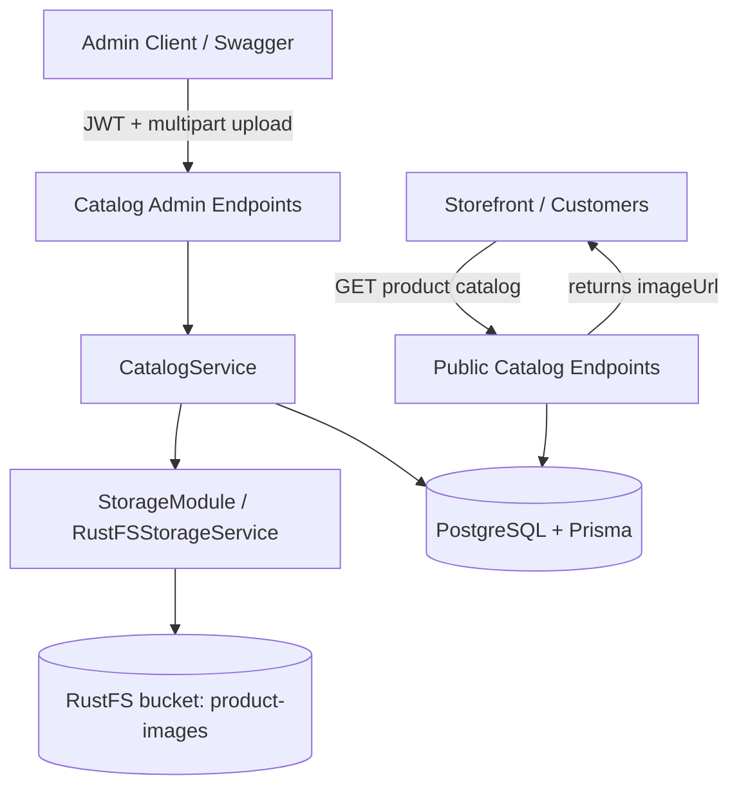

# System Design & Architecture

## Architecture Overview
**What is the high-level system structure?**

### Key components and responsibilities
- **Catalog admin endpoints**: accept multipart file uploads and delete requests for product media
- **CatalogService**: validates product existence, coordinates storage upload/delete, and persists media metadata
- **StorageModule / RustFSStorageService**: wraps the S3-compatible client and exposes `upload`, `delete`, and `publicUrlFor` methods
- **Prisma / PostgreSQL**: stores `imageUrl` and `imageKey` on `Product`
- **RustFS bucket**: stores actual binary media files under a predictable product key prefix

### Technology stack choices and rationale
- **RustFS via S3-compatible APIs** keeps the integration portable and avoids storage-vendor lock-in
- **NestJS FileInterceptor + validation pipes** provide a clean way to support multipart upload with size/type validation
- **Prisma** remains the source of truth for product metadata while object storage handles binary media
- A **dedicated bucket** (`product-images`) keeps catalog media isolated from future storage use cases

## Data Models
**What data do we need to manage?**

### Core entities and relationships
- `Product`
  - existing: `id`, `name`, `slug`, `status`, `imageUrl`, etc.
  - new/confirmed metadata for this feature:
    - `imageKey: String?` — internal object-storage key used for replace/delete operations
    - `imageUrl: String?` — public URL returned to catalog consumers

> v1 intentionally keeps a **single hero image per product**. A separate `ProductMedia` table is deferred until galleries or multiple assets are required.

### Data flow between components
1. Admin calls `POST /api/v1/catalog/admin/products/:id/image` with a multipart `file`.
2. API validates auth, file size, and MIME type (`image/jpeg`, `image/png`, `image/webp`).
3. `CatalogService` confirms the product exists, rejects `ARCHIVED` products, and determines a versioned storage key under a product prefix.
4. `RustFSStorageService` uploads the object to the `product-images` bucket.
5. The service derives a public `imageUrl` and persists `imageKey` + `imageUrl` back to `Product` at write time.
6. On replace, the previous object is deleted after the new metadata update succeeds.
7. Public catalog reads continue returning the product with its latest persisted `imageUrl`.

## API Design
**How do components communicate?**

### External APIs
- `POST /api/v1/catalog/admin/products/:id/image`
  - Auth: `ADMIN` bearer token required
  - Content type: `multipart/form-data`
  - Field: `file`
  - Behavior: upload or replace the hero image for a product
- `DELETE /api/v1/catalog/admin/products/:id/image`
  - Auth: `ADMIN` bearer token required
  - Behavior: remove the hero image object and clear metadata from the product record

### Request/response format
- Successful upload returns the updated catalog product payload for admin/internal use, including:
  - `id`
  - `name`
  - `slug`
  - `imageUrl`
  - `imageKey`
- Public catalog responses continue to rely on `imageUrl` for storefront rendering.
- Error responses:
  - `400` for invalid MIME type / malformed multipart request
  - `401/403` for missing or non-admin auth
  - `404` for unknown product id
  - `413` for files larger than `5 MB`
  - `502/503` for storage-provider failures, if surfaced explicitly

### Internal interfaces
- `StorageService.uploadObject({ bucket, key, body, contentType })`
- `StorageService.deleteObject({ bucket, key })`
- `StorageService.getPublicUrl(bucket, key)`
- `CatalogService.uploadProductImage(productId, file)`
- `CatalogService.deleteProductImage(productId)`

### Authentication/authorization approach
- Upload and delete routes use existing **JWT + RBAC** enforcement with `ADMIN` role checks
- Public catalog read routes remain unauthenticated for storefront consumption
- Storage credentials stay server-side only and are never exposed to clients

## Component Breakdown
**What are the major building blocks?**

### Backend services/modules
- `src/catalog/catalog.controller.ts`
  - add product media upload/delete endpoints
- `src/catalog/catalog.service.ts`
  - add orchestration logic for upload/replace/delete
- `src/storage/storage.module.ts`
  - configure the RustFS client wrapper
- `src/storage/rustfs-storage.service.ts`
  - implement S3-compatible object operations

### Database/storage layer
- **PostgreSQL / Prisma** stores product metadata only
- **RustFS** stores binary image objects in the `product-images` bucket
- The object key should live under a product-specific prefix, such as `products/{productId}/hero.<ext>`

## Design Decisions
**Why did we choose this approach?**

- **Single hero image first** keeps schema changes and UX simple while covering the immediate product-media need
- **Generic storage abstraction** allows “products and more” later without coupling feature code directly to RustFS SDK calls everywhere
- **Store both `imageKey` and `imageUrl`** so internal lifecycle operations stay reliable while public catalog reads stay simple
- **S3-compatible integration** means local RustFS, LocalStack, or another object store can be swapped without changing higher-level business logic

### Alternatives considered
- **Manual URL entry only** was rejected because it does not manage uploads, replacements, or cleanup
- **Database BLOB storage** was rejected because it increases DB size and complicates serving/caching media
- **Multi-file gallery model now** was deferred because v1 only needs one product hero image and implementation speed matters more

## Non-Functional Requirements
**How should the system perform?**

- **Performance**: upload validation should fail fast; public product reads should only return stored URLs and must not call RustFS on every request
- **Scalability**: the storage service should be reusable for future media domains beyond products
- **Security**: validate MIME types and file size, sanitize file names, keep bucket credentials secret, and enforce admin-only write access
- **Reliability**: if the DB update fails after upload, the newly uploaded object should be cleaned up to avoid orphaned files; delete flows should be idempotent where possible
