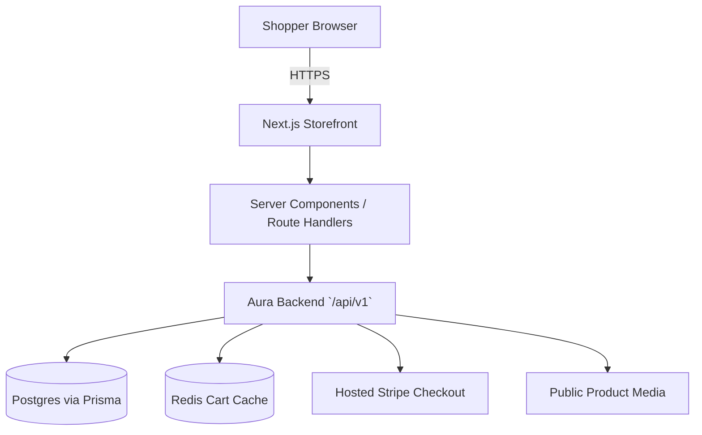

# System Design & Architecture

## Architecture Overview
**What is the high-level system structure?**

### Key components and responsibilities
- **Next.js storefront (`apps/storefront`)**: renders the shopper UI and owns routing/layout concerns
- **Server components**: fetch public catalog data efficiently and keep read-heavy pages SEO-friendly
- **Route handlers / thin BFF layer**: proxy protected requests, attach auth tokens from secure cookies, and normalize backend responses when needed
- **Aura backend**: remains the source of truth for auth, catalog, cart, checkout, and orders
- **Hosted Stripe Checkout**: receives the final redirect handoff from the storefront checkout page

### Technology stack choices and rationale
- **Next.js App Router + TypeScript**: best fit for a modern React storefront with mixed server/client rendering
- **Thin BFF/proxy pattern**: keeps JWT handling server-side and avoids exposing raw auth tokens to browser JavaScript
- **Responsive utility-first styling (Tailwind CSS assumed)**: fast scaffold velocity and easy consistency for catalog/cart layouts
- **`next/image` + public `imageUrl` usage**: uses the backend’s existing media URLs without introducing a separate image service in v1

## Data Models
**What data do we need to manage?**

### Frontend view models
The storefront can stay lightweight by mapping the existing Aura payloads into a small set of UI-focused types:

- `AuthSession`
  - `accessToken`
  - `expiresIn`
  - `user: { userId, email, role, displayName, provider }`
- `ProductCard`
  - `id`, `slug`, `name`, `status`, `isFeatured`, `imageUrl`
  - `category`, `tags`, `priceRange`, `defaultVariant`
- `ProductDetail`
  - product fields plus variant options, price books, inventory flags, and hero media
- `CartSnapshot`
  - `items[]` with `sku`, `quantity`, `unitPrice`, `lineTotal`, `currencyCode`
  - `summary` with `subtotal`, `itemCount`, `distinctItems`
- `CheckoutSessionResult`
  - `checkoutToken`, `sessionId`, `checkoutUrl`, `successUrl`, `cancelUrl`, `expiresAt`, `order`
- `OrderSummary`
  - `orderNumber`, `status`, `paymentStatus`, `grandTotal`, timestamps

### Data flow between components
1. Public storefront routes fetch catalog data from Aura’s public catalog endpoints.
2. The login form posts credentials to a Next.js auth route handler.
3. The route handler calls `POST /api/v1/auth/login`, stores the returned bearer token in an **httpOnly cookie**, and returns session-safe user info to the UI.
4. Protected cart/order/checkout actions flow through server-side helpers or route handlers that attach the bearer token from the cookie.
5. Checkout returns a hosted `checkoutUrl`, and the browser redirects the user to Stripe.

## API Design
**How do components communicate?**

### External Aura endpoints used by the storefront

| Purpose | Aura endpoint | Request shape | Notes |
|---|---|---|---|
| Login | `POST /api/v1/auth/login` | `{ email, password }` | Returns `accessToken`, `tokenType`, `expiresIn`, `user` |
| Current user | `GET /api/v1/auth/profile` | Bearer token | Used for session rehydration |
| Product listing | `GET /api/v1/catalog/products` | none | Returns `{ items, total }` |
| Product detail | `GET /api/v1/catalog/products/:slug` | slug param | PDP source of truth |
| Categories | `GET /api/v1/catalog/categories` | none | Supports browse filters/nav |
| Tags | `GET /api/v1/catalog/tags` | none | Supports browse filters/nav |
| Cart view | `GET /api/v1/cart` | Bearer token | Returns cart snapshot |
| Add cart item | `POST /api/v1/cart/items` | `{ sku, quantity, currencyCode? }` | Auth required |
| Update cart item | `PATCH /api/v1/cart/items/:sku` | `{ quantity }` | Use `0` to remove |
| Remove cart item | `DELETE /api/v1/cart/items/:sku` | none | Auth required |
| Start checkout | `POST /api/v1/checkout/session` | `{ couponCode?, successUrl?, cancelUrl? }` | Returns hosted Stripe redirect info |
| Order history | `GET /api/v1/orders/me` | Bearer token | Auth required |

### Internal interfaces in the storefront
- `lib/aura/client.ts`
  - shared typed fetch wrapper for Aura requests
- `lib/auth/session.ts`
  - read/write auth cookie and decode current session state
- `app/api/auth/login/route.ts`
  - proxy login to Aura and set secure cookies
- `app/api/auth/logout/route.ts`
  - clear session cookie
- `app/api/cart/*` or server actions
  - optional mutation boundary for cart updates without leaking tokens client-side

### Authentication/authorization approach
- Aura JWTs should be stored in **secure, httpOnly, same-site cookies** managed by Next.js
- Protected routes such as `/cart`, `/checkout`, and `/account/orders` should check for a valid session before rendering
- UI behavior may vary by role (`CUSTOMER`, `ADMIN`), but v1 only requires customer-facing protected flows

## Component Breakdown
**What are the major building blocks?**

### Frontend routes/components
- `app/page.tsx` — landing page / featured catalog highlights
- `app/products/page.tsx` — browse/search/filter view
- `app/products/[slug]/page.tsx` — product detail page
- `app/cart/page.tsx` — authenticated cart management
- `app/checkout/page.tsx` — checkout review and redirect action
- `app/login/page.tsx` — auth entry point
- `app/account/orders/page.tsx` — authenticated order history
- `components/layout/*` — header, footer, role-aware nav, shell
- `components/catalog/*` — cards, filters, PDP blocks, image gallery
- `components/cart/*` — cart table, quantity controls, order summary
- `components/auth/*` — login form, session badge, access guard states

### Backend dependencies already present
- `AuthModule` for login/profile
- `CatalogModule` for browse and product detail data
- `CartModule` for persistent cart state
- `PaymentsModule` for checkout session creation and order history
- Media-backed product `imageUrl` values from storage integration

## Design Decisions
**Why did we choose this approach?**

- **In-repo storefront app**: keeps backend + frontend docs and local integration in one workspace during initial delivery
- **Thin BFF over direct browser-to-Aura auth**: reduces token leakage risk and keeps request normalization centralized
- **Server components for catalog**: better defaults for performance and SEO on product browsing pages
- **Client components only where necessary**: cart controls, login forms, and checkout initiation stay interactive without over-hydrating the app
- **Customer-first scope**: ensures the core revenue path ships before optional admin UX work

### Alternatives considered
- **Separate repo immediately** was deferred to avoid premature workspace fragmentation while the contract is still settling
- **Pure client-side SPA auth with localStorage tokens** was rejected for weaker security and poorer App Router ergonomics
- **Full admin console in the same phase** was deferred to protect timeline and keep scope implementation-ready

## Non-Functional Requirements
**How should the system perform?**

- **Performance**
  - Public catalog pages should aim for fast first paint and use revalidation where safe
  - Cart/checkout/order routes must avoid stale cached auth-sensitive data
- **Scalability**
  - Add new storefront domains (wishlists, reviews, account settings) without rewriting the app shell
- **Security**
  - No Aura secrets or raw tokens should be exposed in the browser bundle
  - Use secure cookie storage and route protection for authenticated pages
- **Reliability**
  - Loading, empty, and failure states must exist for catalog, cart, and account pages
  - If upstream Aura requests fail, log server-side details and surface an actionable UI message rather than masking the error silently
