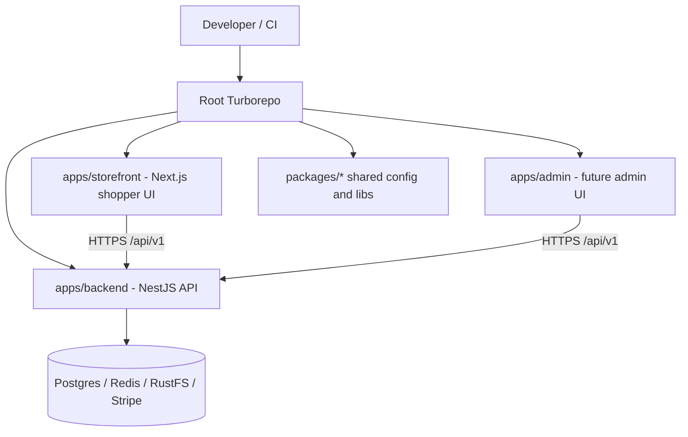

# System Design & Architecture

## Architecture Overview
**What is the high-level system structure?**

### Key components and their responsibilities
- **Root workspace**: owns `turbo.json`, `pnpm-workspace.yaml`, shared scripts, and repo-level documentation
- **`apps/backend`**: contains the Aura NestJS API, Prisma schema/seed workflow, tests, and backend-specific build/runtime config
- **`apps/storefront`**: contains the Next.js shopper-facing frontend already integrated with Aura
- **`apps/admin`**: reserved for a future admin site so expansion does not require another repo restructure
- **`packages/*`**: shared configuration and reusable code, starting small (for example TypeScript config, ESLint config, shared utilities/types)
- **Turborepo**: orchestrates task execution, dependency awareness, and caching across all workspace projects

### Technology stack choices and rationale
- **Turborepo** is chosen for build orchestration because it adds task graph awareness, incremental execution, and CI-friendly caching without changing the package manager.
- **pnpm** remains the package manager because the repo already uses it and it works well with workspaces and Turborepo.
- **Apps-first structure** (`apps/backend`, `apps/storefront`) keeps runtime ownership explicit and makes it easy to add `apps/admin` later.
- **Shared packages** are intentionally lightweight at first so the migration improves structure without forcing premature abstraction.

## Data Models
**What data do we need to manage?**

This feature is primarily a **workspace architecture** change, not a product-domain data-model change. The important “models” are the repo building blocks and their relationships.

### Core workspace entities
- `WorkspaceApp`
  - `name`
  - `path`
  - `runtime` (`nestjs`, `nextjs`, future `nextjs-admin`)
  - `devCommand`, `buildCommand`, `testCommand`, `lintCommand`
- `SharedPackage`
  - `name`
  - `path`
  - `purpose` (`eslint-config`, `typescript-config`, shared utils/types)
  - `consumers[]`
- `PipelineTask`
  - `name` (`build`, `dev`, `lint`, `test`, `typecheck`)
  - `dependsOn[]`
  - `outputs[]`
  - `cache` behavior

### Data flow between components
1. A developer or CI job invokes a root command such as `pnpm build`.
2. The root script delegates to `turbo run build`.
3. Turborepo resolves the dependency graph and runs the relevant app/package tasks.
4. `apps/storefront` and future `apps/admin` continue consuming the Aura backend over `/api/v1`.
5. Shared packages provide config or reusable code where cross-app duplication would otherwise grow.

## API Design
**How do components communicate?**

### External APIs (unchanged by this feature)
- `apps/storefront` continues to call Aura backend endpoints under `http://localhost:3000/api/v1`
- Future `apps/admin` should reuse the same authenticated backend contract rather than introducing a second API surface

### Internal interfaces
- Root `package.json` delegates common tasks to Turborepo
- `turbo.json` defines the repo task graph and outputs
- App-local `package.json` files remain the source of truth for each app’s actual commands
- Shared packages expose configuration or utilities through normal workspace package imports

### Request/response formats
No business API payload changes are required. This migration should preserve current auth/catalog/cart/checkout/order flows and only improve repo structure and task orchestration.

### Authentication/authorization approach
- **Unchanged** from current behavior
- Storefront keeps secure cookie-based session handling for shopper auth
- Future admin app should follow the same server-side auth pattern and Aura RBAC roles

## Component Breakdown
**What are the major building blocks?**

### Root-level components
- `turbo.json`
- `pnpm-workspace.yaml`
- root `package.json`
- root README and repo docs
- root Docker orchestration files where appropriate

### Backend components
- `apps/backend/src/*`
- `apps/backend/prisma/*`
- `apps/backend/test/*`
- `apps/backend/nest-cli.json`, `tsconfig*.json`, app-local package manifest

### Frontend components
- `apps/storefront/*` (already present)
- future `apps/admin/*` if/when the admin interface is introduced

### Shared packages
Recommended starting set:
- `packages/eslint-config`
- `packages/typescript-config`

Optional later additions:
- `packages/shared-types`
- `packages/ui`
- `packages/config`

## Design Decisions
**Why did we choose this approach?**

- **Move the backend into `apps/backend`** rather than leaving it at the root, because the user explicitly wants backend and frontend in separate folders.
- **Use Turborepo instead of plain pnpm workspaces alone** because the repo now has multiple applications and benefits from caching and graph-aware task execution.
- **Keep the admin site deferred** instead of building it now, because the immediate goal is monorepo readiness rather than expanding product scope.
- **Start with shared config packages, not a large shared-code layer**, to avoid forcing cross-app coupling before the real reuse patterns are clear.

### Alternatives considered
- **Leave the backend at the root and only add Turbo**: rejected because it does not satisfy the desired folder separation.
- **Split into multiple repos**: rejected because backend/storefront/admin need coordinated local development and shared tooling.
- **Create many shared packages immediately**: rejected as unnecessary complexity during the initial monorepo migration.

## Non-Functional Requirements
**How should the system perform?**

- **Performance**
  - Root tasks should support incremental execution and cached outputs
  - CI should avoid rebuilding unaffected apps when possible

- **Scalability**
  - The workspace should support at least backend + storefront + admin without another structural rewrite
  - Shared packages should allow gradual consolidation of duplicated config/code

- **Security**
  - App-specific environment variables should stay scoped to the relevant app
  - The migration must not weaken the storefront’s auth/session handling or expose secrets through shared tooling

- **Reliability/availability**
  - Existing build, test, Docker, and local dev flows should remain reproducible after the migration
  - The implementation should include regression verification for both backend and storefront before the move is considered complete
